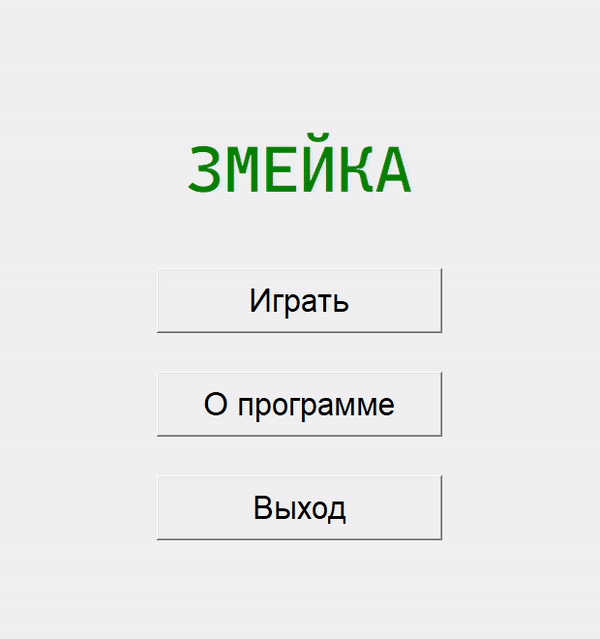

# Snake game
Проект был выполнен в рамках курсовой работы по объектно-ориентированному программированию. Была разработана игра «Змейка» на Python в виде оконного приложения с использованием библиотек Tkinter и Pillow.

# Демонстрация

# Установка
1. Установить Python версии 3.x.
2. Создать в папке проекта виртуальное окружение командой `python –m venv venv` (если на устройстве имеется Python версии 2, то `python3 –m venv venv`).
3. Активировать виртуальное окружение командой `venv\Scripts\activate` на Windows или `source venv/bin/activate` на Linux.
4. Установить зависимости из файла *requirements.txt* командой `pip install –r requirements.txt`.